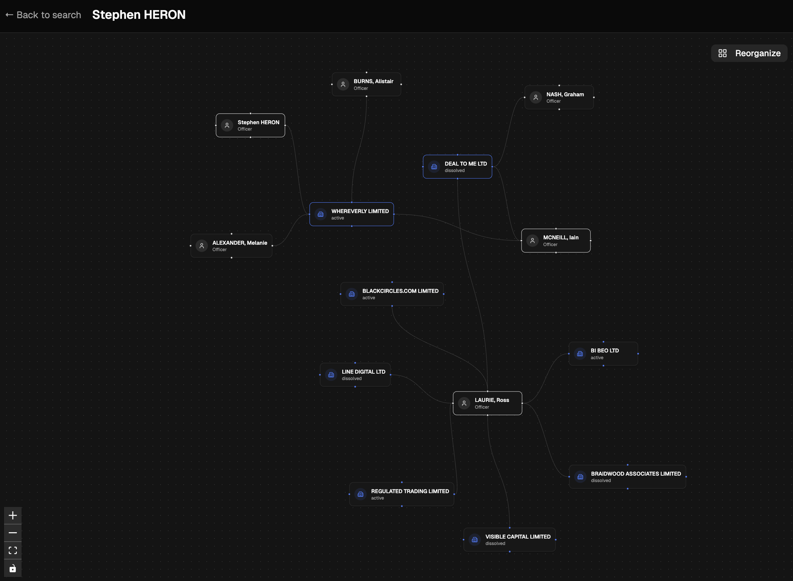

# Companies House Explorer

A full-stack web application for exploring UK Companies House data. Search for corporate officers, visualize their business relationships in an interactive graph, and review company filings with AI-powered summaries.



## Features

- **Officer Search** - Search for officers by name with results showing appointment counts and addresses
- **Interactive Relationship Graph** - Visual network diagram showing officers, companies, and their connections. Double-click nodes to expand and discover relationships, single-click to view details in a side panel
- **Company & Officer Details** - View company profiles, officer appointments, and filing history
- **AI-Powered Filing Summaries** - Automatically summarizes company filings using OpenRouter with PDF OCR, extracting key financial data from annual accounts

## Getting Started

### Prerequisites

You'll need API keys for:

- [Companies House API](https://developer.company-information.service.gov.uk/)
- [OpenRouter API](https://openrouter.ai/) (for AI filing summaries)

### Setup

```bash
npm install
```

Create a `.env` file with your API keys:

```
COMPANIES_HOUSE_API_KEY=your_key_here
OPENROUTER_API_KEY=your_key_here
```

### Development

```bash
npm run dev
```

### Build

```bash
npm run build
npm run preview
```

## Project Structure

```
src/
  routes/
    index.tsx                  # Home/search page
    officer.$officerId.tsx     # Officer detail page with graph
    api/chat.ts                # AI filing summary endpoint
  components/
    graph/
      relationship-graph.tsx   # Interactive graph visualization
      officer-node.tsx         # Officer node component
      company-node.tsx         # Company node component
      detail-sheet.tsx         # Side panel for node details
      graph-layout.ts          # Layout algorithms
    ui/                        # shadcn/ui components
    search-input.tsx           # Search input component
  lib/
    companies-house.ts         # Companies House API server functions
    utils.ts                   # Utility functions
```
